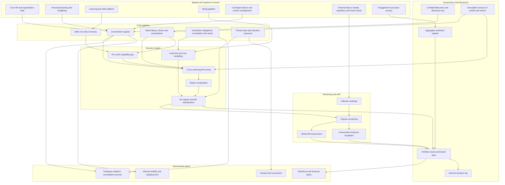

# Regretcast

**Source:** `ai-in-hr/workforce-of-the-future-the-competing-forces-shaping-2030-pwc/`
**Domain:** `ai-hr`
**One-liner:** A workforce commitment register that prices every people decision — hiring plans, reskilling spend, site footprint, contingent-labour ratios, automation cases, reward redesign — for its payoff in each of four competing 2030 worlds, separates the no-regrets moves from the bets, and puts a monitored tripwire on every bet so that a change of world becomes a scheduled decision rather than a crisis.
**Wedge:** Group workforce strategy in multinationals of 10,000-plus employees facing a footprint or automation decision inside the next two budget cycles — instrumented first on one function (operations, engineering, or customer service) across three countries whose labour regimes diverge sharply on collective consultation, notice and permitted redundancy.
**Positioning:** Scenario-based workforce planning as a portfolio discipline rather than a forecasting exercise. Conventional strategic workforce planning produces one demand curve and a headcount plan; Regretcast refuses the point forecast, holds four plausible worlds simultaneously as the source does, computes regret across them for every commitment, and makes "which world are we drifting into" an instrumented question answered on the budget calendar instead of in a board post-mortem.

## Market research synthesis

### Thesis from source

The report's central methodological claim is that linear predictions of the future of work are not merely imprecise but the wrong shape of answer. Its research lineage is stated: a programme begun in 2007 with the James Martin Institute for Science and Civilisation at the Saïd Business School in Oxford, refreshed with a commissioned survey of 10,029 members of the general population in China, Germany, India, the UK and the US, of whom 8,459 are not retired. The megatrends — technological breakthroughs, demographic shifts, rapid urbanisation, shifts in global economic power, and resource scarcity and climate change — set the context but explicitly do not dictate the outcome. The report insists the real story "is less about technological innovation and more about the manner in which humans decide to use that technology," and so it adds two human dynamics to the analysis: collectivism against individualism, and corporate integration against business fragmentation. Crossing those two axes produces the Four Worlds of Work in 2030, and the report is careful to say facets of all four will likely feature, that some sectors already display elements of Blue and Green, and that Red and Yellow — once thought implausible — could now go either way.

What makes those worlds usable rather than decorative is that each does something specific and incompatible to the people function, which is precisely what a single-scenario plan cannot represent. In the **Red World** (innovation rules; fragmentation plus individualism) HR does not exist as a separate function; entrepreneurial leaders rely on outsourced services and automation for people processes, careers are "built from individual blocks of skills, experience and networks," near-zero-employee organisations become the norm, larger firms "acqui-hire" talent and intellectual property, performance is judged on end results with old-fashioned measurement rare, and the report's illustrative timeline has US full-time permanent employment falling to 9% of the workforce by 2030 — against which 60% of survey respondents already think few people will have stable, long-term employment in the future. In the **Blue World** (corporate is king; integration plus individualism) the Chief People Officer sits on the board, sometimes titled "Head of People and Productivity", the science of human capital has matured to the point that the people-performance link is explicitly demonstrable, "retainer and call-up" contracts cover rare skills, top talent engages agents to negotiate, and performance and wellbeing are "measured, monitored and analysed at every step" both in and outside the workplace — the report's blunt formulation is that "the price workers must pay is their data", and 70% of respondents say they would consider treatments to enhance brain and body if it improved their employment prospects. In the **Green World** (companies care; integration plus collectivism) HR is renamed "People and Society", natural and social capital impact balance sheets become an accounting requirement, and "many people decisions are tightly controlled by regulation, from diversity quotas to mandatory wellbeing support, to the number of redundancies companies can make during a downturn"; 23% of respondents say doing a job that makes a difference matters most to their career. In the **Yellow World** (humans come first; fragmentation plus collectivism) new worker Guilds take over training, certification, pensions and wellbeing, the traditional core functions of HR are "held by business leaders, the collective or taken on by Guilds", a widening range of work is regulated by concepts of "good jobs" and decent work, and 25% of respondents say their ideal employer is one whose values match their own.

The report's prescription is a decision doctrine, not a forecast, and it is unusually explicit. "No regrets and bets": plan for a dynamic rather than a static future, recognise multiple and evolving scenarios, make no-regrets moves that work with most scenarios — "but you'll need to make some bets too." "Act now," because change is already happening. "Protect people not jobs," on the grounds that organisations cannot protect roles made redundant by technology but retain a responsibility to the people in them. "Your starting point matters as much as your destination," so the right response may be radical change or only a few steps. "Own the automation debate," since it is too important to leave to IT or HR alone. And "build a clear narrative," because a third of workers are anxious about the future and their job due to automation — "an anxiety that kills confidence and the willingness to innovate" — which makes sentiment a present-tense operating cost rather than a communications afterthought. Among the 'no regrets' moves it lists two that this product implements literally: use sophisticated workforce planning and predictive analytics to plan talent pipelines in multiple future scenarios, and understand the skills you have in your workforce now, "not just the roles your workers currently do."

The numbers that bound the exposure are asymmetric in a way that matters for any multi-country employer. Jobs at risk of automation differ sharply by country — the US at 38%, Germany 35%, the UK 30%, Japan 21% — so a footprint decision that looks like one commitment is four different bets depending on where it lands. Worry about automation putting jobs at risk has risen to 37% from 33% in 2014, while 73% still think technology can never replace the human mind and 65% think technology will improve their job prospects; 74% say they are ready to learn new skills or completely retrain, and 74% believe updating their skills is their own responsibility rather than any employer's — a figure that should discipline any business case resting on assumed take-up of employer-sponsored reskilling. Meanwhile 56% think governments should take any action needed to protect jobs from automation, which is the demand signal behind the Green and Yellow regulatory scenarios. From the parallel CEO survey: 52% are already exploring humans and machines working together, 39% are considering AI's impact on future skills needs, and 52% plan to increase headcount in the next twelve months — expansion and automation simultaneously, which is why treating automation as a headcount-reduction programme mis-specifies the decision. Self-reported capability (Figure 3) is strongest on adaptability at 86%, problem solving 85%, collaboration 81% and emotional intelligence 76%, and weakest at the foot of the list on entrepreneurial skills at 50%. And the report's 'pivotal people' — those contributing outsized and crucial value — will be hard to find, difficult to keep in a loyalty-light world, and in the hard-driven Red and Blue worlds at constant risk of burnout or early retirement funded by the rewards they command.

The design conclusion is that the commercially defensible object is not a forecast at all. It is a **register of workforce commitments**, each carrying a named owner, a budget line, a decision date, a reversibility class, and an explicit payoff in each named world — from which a regret profile and a no-regrets-or-bet classification is computed rather than asserted. Around it sit the three things the source says make that register honest: a skills-not-roles inventory to test each world's demand against, jurisdiction-specific consultation and notice obligations priced into each commitment's lead time, and a sentiment reading published alongside the plan because the anxiety is a cost today.

### Buyer & economic model

- **Primary buyer:** the Group Chief People Officer, jointly with the Chief Strategy Officer — in the source's Blue World this buyer is literally a board seat, the "Head of People and Productivity". The approval gate is the Chief Financial Officer, because every commitment in the register carries a budget line and a stranded-cost exposure.
- **Users:** group workforce strategy and planning leads (weekly); country HR directors and HR business partners (monthly and at each commitment landing in their jurisdiction); finance business partners (budget and capital cycle); the automation and transformation programme office (recording initiatives and their skills implications); reward and mobility leads; employee representatives and works council secretariats (information and consultation); risk and internal audit (reversibility and disclosure control); the executive committee and the board people committee (scheduled portfolio review).
- **Budget owner / value metric:** the strategic workforce plan and the transformation and reskilling envelope. The headline value metric is **regret exposure avoided per unit of committed spend** — the cost of commitments that would be stranded if the world moved differently — supported by the share of committed spend classified as no-regrets, the proportion of bets carrying a live tripwire with a pre-agreed response, and the tripwire hit rate: how often a threshold fired before rather than after the business felt the shift.
- **Competing status quo:** a single-scenario strategic workforce plan held in spreadsheets and refreshed annually; a separate automation business case owned by the transformation office on its own assumptions; a separate reskilling programme owned by learning with its own take-up optimism; and a country-by-country redundancy plan drafted by employment counsel at the point of crisis. These four artefacts do not share assumptions, no one owns the contradictions between them, and the anxiety narrative the source identifies is handled by internal communications after decisions are announced. Scenario planning, where it happens at all, is a one-off offsite whose output is a deck rather than a register anyone is accountable to.

### Domain constraints

- **Regulatory / trust / safety:** collective information and consultation duties — works councils, European Works Councils, country redundancy thresholds, notice periods, social plans — mean that a bet implying headcount reduction has a legally mandated process and timetable which must be modelled inside the bet's own lead time and cost, not appended to it. The source's Green World explicitly anticipates regulation on the number of redundancies permitted during a downturn, which is precisely the constraint that converts a plan the board believes is reversible into one that is not. Redeployment and suitable-alternative-employment obligations mean the register must be able to evidence which internal options were considered before any external action, and in what order. Selection for redundancy or for redeployment must survive fairness challenge, so any scoring that ranks people or roles is subject to adverse impact testing rather than being treated as a planning artefact. The Blue World's monitor-everything scenario collides head-on with employee monitoring limits and purpose limitation, so sentiment and productivity measurement inside the platform must be aggregate, minimised and documented as to lawful basis — the product must be able to model that world without operating it.
- **Data sensitivity:** scenario work names sites, functions and occasionally individuals for closure or reduction months or years before anything is decided, let alone announced. Premature disclosure is simultaneously a market-sensitive event, an industrial-relations breach and a personal harm, so confidentiality tiers and a per-person disclosure log are functional requirements rather than hygiene. Sentiment readings must not be re-identifiable to teams small enough to expose individuals, which means minimum aggregation thresholds enforced at query time. Pivotal-people flight-risk and burnout flags are career-affecting inferences about named individuals and need a narrower access tier than the rest of the register, with the individual's own manager not automatically included.
- **Change-management realities:** the source's insistence that "your starting point matters as much as your destination" means the product has to be useful to an organisation whose only workforce inventory is job titles, and must let a skills view accrete rather than demanding it upfront. Executives will reject any tool that asks them to pick one future, so holding four worlds simultaneously has to be cheap — scoring a commitment across all four must take minutes, not a workshop. The budget and capital approval calendar, not the scenario, sets the decision rhythm, so portfolio reviews must land before approvals rather than after. And since 74% of the source's respondents regard skill updating as their own responsibility, an employer-side reskilling commitment carries an adoption risk that has to be an explicit, re-forecast assumption rather than a planning constant.

## Business requirements

- BR-1: Every material workforce commitment must be registered as a discrete decision object with a named accountable owner, a budget line, a decision date, a reversibility class, and an explicit payoff assessment in each of the four named worlds; no commitment may enter the plan on a single-scenario justification.
- BR-2: Each commitment must be classified as a no-regrets move or a bet by computation from its payoff spread across worlds rather than by assertion, and the portfolio must report committed spend and headcount impact in each class.
- BR-3: Every bet must carry at least one monitored tripwire indicator with a stated threshold, a named owner, a review date and a pre-agreed response, so that a change in the external world triggers a scheduled decision instead of an emergency.
- BR-4: The workforce inventory must be held as skills and capabilities rather than only roles and job titles, and every gap analysis must be expressed against the skills each world demands, not against a single demand forecast.
- BR-5: Any commitment implying headcount reduction must carry its jurisdiction-specific consultation, notice and severance timetable and cost inside its own lead time, and must evidence the internal redeployment options considered before external action.
- BR-6: Confidentiality must be enforced by tier with a per-person disclosure log for every site-, function- or individual-level reduction scenario, because premature disclosure is itself a material risk to the organisation and to individuals.
- BR-7: Employee sentiment about automation and the future of work must be measured and reported alongside the plan as a present-tense business metric, at an aggregation level that cannot identify individuals or small teams, on a documented lawful basis.
- BR-8: Pivotal roles and the people holding them must be identified with retention and burnout exposure assessed under each world, and no bet may be approved whose success depends on individuals flagged as flight or burnout risks without a named, funded mitigation.
- BR-9: Reskilling and internal-mobility commitments must state their assumed take-up rate explicitly and be re-forecast against actual take-up at each review, because the source shows individuals overwhelmingly regard skill updating as their own responsibility.
- BR-10: The board or its people committee must receive a scheduled portfolio review — aligned to the budget and capital approval calendar — showing regret exposure, tripwire status, an assessment of world drift, and every commitment whose classification has changed since the last review.
- BR-11: World definitions, driver assumptions and payoff rubrics must be versioned with authorship and rationale and must not be retrospectively editable, so that any decision can be re-examined against what was believed when it was taken rather than what is believed now.
- BR-12: The organisation must maintain and publish an internal narrative of how it is planning for automation and the future of work, and the platform must record what was communicated, to whom and when, so that the public narrative and the private register cannot silently diverge.

## User stories

Canonical user stories live in sibling [USER_STORIES.md](USER_STORIES.md).

## System design

### Overview

Regretcast turns workforce strategy from a forecast into a governed portfolio. Four world scenarios are held as first-class, versioned objects, each defined by its position on the source's two axes and each carrying a demanded-skills profile, an HR operating-model implication, and a set of observable drivers. Every material people commitment is registered against them: the owner names it, ties it to a budget line and a decision date, declares its reversibility, and scores its payoff in each world. From those four scores the platform computes a regret profile — the loss incurred if the organisation commits and a different world arrives — and derives the classification the source asks for, no-regrets or bet. Bets must then be armed: each gets one or more tripwire indicators with thresholds, owners, review dates and a pre-agreed response. Externally sourced and internal readings update those tripwires continuously, and a drift assessment rolls them up into a view of which world the organisation appears to be moving toward. Two supporting registers keep the scoring honest rather than rhetorical: a skills-not-roles inventory tested against each world's demanded-skills profile, and a jurisdiction obligation model that prices consultation, notice and redeployment duties into each commitment's own lead time. A sentiment register and a narrative log sit alongside, because the source treats workforce anxiety as a cost incurred today and the internal story as something that must match the register. Output is a scheduled portfolio review pinned to the budget calendar rather than a dashboard nobody opens.

### Actors & boundaries

- **Actors:** group workforce strategy lead; Chief People Officer and Chief Strategy Officer; Chief Financial Officer and finance business partners; country HR directors and HR business partners; transformation and automation programme leads; reward and mobility leads; works council and trade union representatives; risk and internal audit; the board people committee; governance administrator; and external data providers supplying labour-market, regulatory and macro indicators that feed tripwires.
- **Trust boundary:** Regretcast is the register of *decisions and their assumptions*, not a system of action. It does not hire, terminate, pay, or select individuals for redundancy; it records what was committed, on what reasoning, with what obligations, and what would change the answer. Execution stays in the HR, finance and case systems, which means the register can hold pre-decisional and market-sensitive content under confidentiality tiers that the operational systems could not safely carry. Individual-level content is deliberately narrow: pivotal-role and retention exposure is in scope, individual performance and monitoring data is out of scope by design, because the product must be able to model the Blue World's surveillance scenario without implementing it.
- **Human-in-the-loop points:** payoff scoring is a named human judgement with a recorded rationale, never a model output; classification as no-regrets or bet is computed but reviewable and overridable with reasons; a country HR director can veto a commitment's lead-time feasibility in their jurisdiction; tripwire responses are executed by the named owner, and the system's role is to insist the decision is taken, not to take it; consultation packs are released by a human with the duty; every access to a tier-restricted reduction scenario is logged to a person.

### Core capabilities

1. **World library and assumption registry** — the four scenarios as versioned objects with axis positions, megatrend drivers, HR operating-model implications, demanded-skills profiles, and probability weightings held as declared beliefs rather than facts.
2. **Commitment register** — the decision objects: owner, budget line, decision date, reversibility class, affected functions and jurisdictions, dependencies.
3. **Cross-world payoff scoring and regret computation** — per-world payoff with rationale, regret profile, robustness measures, and portfolio-level regret exposure.
4. **No-regrets and bet classification** — computed classification, committed spend and headcount impact by class, and override with reasons.
5. **Tripwire monitoring and world-drift assessment** — indicators, thresholds, readings, firing, pre-agreed responses, escalation when a response is not executed in its window, and roll-up into drift.
6. **Skills inventory and per-world demand gap** — skills held rather than roles held, demanded-skills profiles per world, and the gap expressed per world rather than as a single number.
7. **Jurisdiction obligation modelling** — consultation, notice, severance and redeployment duties per country, priced into commitment lead time and cost.
8. **Redeployment option register** — internal alternatives considered before external action, in evidenced order.
9. **Pivotal-role and retention exposure** — pivotal roles, the people in them, and flight and burnout exposure assessed per world, with mitigation dependency checks on bets.
10. **Sentiment and narrative register** — aggregate workforce sentiment on automation and the future of work, with the record of what was communicated internally, to whom and when.
11. **Confidentiality, disclosure and versioning** — tiers, per-person disclosure logging, and immutable version history of worlds, assumptions and rubrics.
12. **Portfolio review and board reporting** — scheduled review packs aligned to the budget and capital calendar, with classification changes since last review.

### Conceptual data

- **Primary entities:** WorldScenario, MegatrendDriver, Assumption, PayoffRubric, Commitment, PayoffAssessment, RegretProfile, Classification, Tripwire, TripwireReading, DriftAssessment, PortfolioReview, SkillInventoryEntry, SkillDemandProfile, CapabilityGap, Jurisdiction, JurisdictionObligation, ConsultationPlan, RedeploymentOption, PivotalRole, RetentionExposure, SentimentReading, NarrativeCommunication, ConfidentialityTier, DisclosureLogEntry.
- **Critical events:** commitment registered; payoff scored in each world; regret computed and classification derived or overridden; jurisdiction feasibility accepted or vetoed; tripwire armed, threshold breached, response executed or lapsed; drift assessment published; commitment reclassified; consultation duty triggered and pack released; redeployment options recorded; pivotal-role dependency blocked a bet; reskilling take-up re-forecast against assumption; sentiment reading published; narrative communication issued; world definition or rubric versioned; restricted scenario disclosed to a named person.
- **Retention / audit needs:** commitments, payoff assessments, classifications and the world and rubric versions in force at the time of each decision retained for the full corporate governance and employment-litigation window, because the defensibility of a reduction decision years later depends on showing what was believed and what alternatives were considered when it was taken. Disclosure logs retained independently and for longer than the scenarios they govern, since they are the evidence for any confidentiality or insider-information question. Sentiment readings retained only in aggregate, with the minimum aggregation threshold recorded alongside each reading so the privacy posture is auditable. Pivotal-people retention exposure held on a short, reviewed clock because it is a career-affecting inference about a named individual. World definitions, assumptions and payoff rubrics held as immutable versions with authorship, never amended in place.

### Integrations (conceptual)

- **Systems of record:** core HR and organisation data (headcount, roles, locations, contract types, working patterns), financial planning and budgeting (the budget lines commitments are tied to), the capital approval and investment governance process, the learning and skills platform (feeding the skills-not-roles inventory), the applicant tracking system (pipeline reality behind a hiring commitment), the vendor management system (contingent and off-balance-sheet labour ratios), and employee relations case management (consultation and collective process records).
- **Upstream signals:** external labour-market and wage data by country and skill; the country automation-exposure estimates the source quantifies; regulatory and legislative trackers in each jurisdiction, which are the natural tripwire sources for the source's Green and Yellow worlds; engagement and pulse-survey platforms supplying aggregate sentiment; talent-marketplace and platform-labour availability signals relevant to the Red and Yellow worlds; macroeconomic and sector indicators; and internal transformation and automation programme milestones.
- **Downstream actions:** approved commitments released into workforce and financial plans; consultation packs issued into employee relations process with statutory clocks started; redeployment option sets pushed into internal mobility; tripwire firings raised as scheduled decisions into the executive and board agenda; reskilling take-up variances returned to learning as re-forecasts; pivotal-role mitigations raised into reward and succession; board portfolio review packs; and the internal narrative published through communications with its record written back to the register.

### High-level architecture

Three clocks have to be kept apart. Scoring and registration happen at the pace of human deliberation; tripwire readings arrive continuously from outside; decisions land on the budget and capital calendar. The design's whole purpose is to stop the continuous signal from being ignored until the calendar forces a crisis, and to stop the calendar from forcing decisions the signals do not yet justify.

### Success metrics

- **Leading:** share of material workforce commitments registered with a payoff score in all four worlds rather than a single-scenario justification; share of committed spend classified as no-regrets; proportion of bets carrying a live tripwire with a named owner and a pre-agreed response; median lag between an indicator breaching its threshold and the response decision being taken; proportion of commitments whose lead time incorporates jurisdiction-specific consultation and notice timetables; share of the workforce represented in the skills inventory as skills rather than only job titles; reskilling take-up variance against the assumption stated at approval; count of commitments vetoed on jurisdiction feasibility before implementation; completeness of the disclosure log against restricted-scenario access.
- **Lagging:** realised stranded cost on commitments the world moved against, versus the regret exposure forecast at approval; proportion of tripwires that fired before rather than after the business felt the shift; number of reduction decisions successfully challenged on consultation, selection or redeployment grounds; regretted attrition among people in pivotal roles; time from a board-recognised change in world conditions to an approved change in the workforce plan; movement in aggregate workforce sentiment on automation against the source's baseline anxiety figures; and the proportion of the plan still executable unchanged after a world-drift reassessment, which is the direct measure of whether the portfolio was genuinely robust or merely described as such.

## OpenAPI skeleton

Canonical HTTP surface lives in sibling [openapi.yaml](openapi.yaml). Summary:

- **Base path:** `/v1/...`
- **Auth:** `X-API-Key` for system-to-system feeds from financial planning, HR, skills, and external indicator providers; Bearer JWT for strategy, finance, country HR, representative and governance operators, with confidentiality tier enforced per caller.
- **Resource groups:** Worlds, Commitments, Payoff, Portfolio, Tripwires, Skills, Jurisdictions, PivotalTalent, Narrative, Governance.
