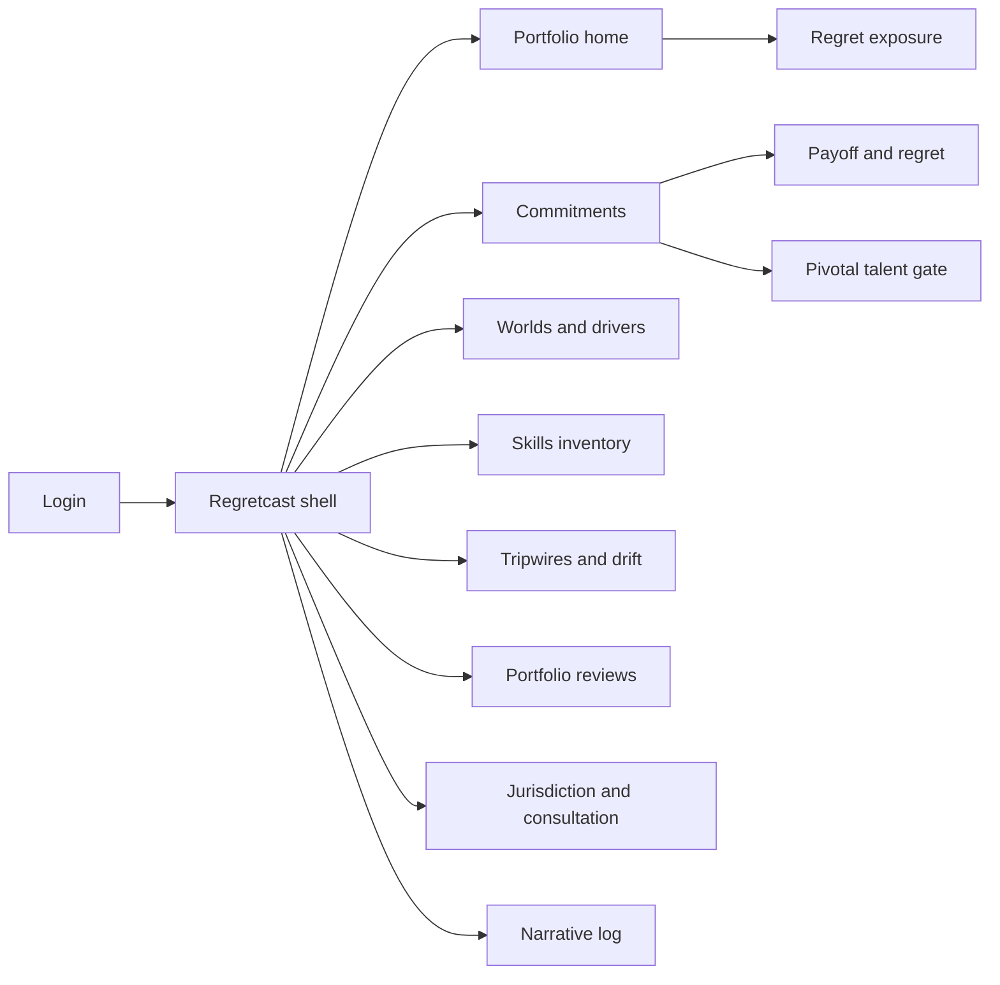
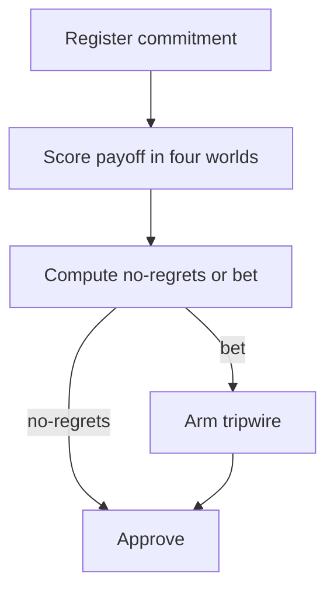
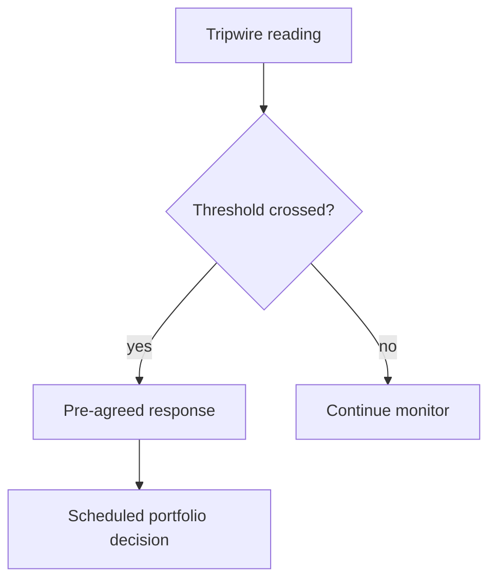

# Regretcast — Web app

**Product:** [PRODUCT.md](./PRODUCT.md)
**Primary surface:** Workforce commitment portfolio console (group strategy + people committee workspace)
**Secondary surfaces:** Country consultation pack builder; board portfolio review pack (scheduled export)
**Design thesis:** Regretcast is a four-world trading desk for people commitments — not a single-scenario headcount forecast. The UI metaphor is a portfolio blotter: every hiring, reskilling, footprint, contingent, automation or reward commitment is scored for payoff in Red, Blue, Green and Yellow worlds; regret is computed, not asserted; bets carry live tripwires that fire on the budget calendar. Visual language is deep midnight with four distinct world accents that never collapse into one “most likely” purple — no-regrets moves feel settled slate; bets feel provisional amber until tripwires are armed. The brand wordmark sits as a quiet mark on every portfolio review so the board knows whose register they are approving against.

## UX research synthesis

### Category peers (best-in-class)

- **Anaplan / Workday Adaptive Planning:** Multi-scenario financial planning with versioned assumptions. Steal: commitment objects with budget lines and decision dates; reject forcing a single “official” scenario as the only active plan.
- **Palantir Foundry decision apps (strategy):** Explicit alternatives with monitored triggers. Steal: tripwires with pre-agreed responses; reject exploratory notebooks as the executive surface.
- **Visier / ChartHop workforce planning:** Skills and org views for planners. Steal: skills-not-roles inventory accretion; reject role-only demand curves as the gap language.
- **BoardEffect / Diligent board portals:** Scheduled committee packs with confidentiality. Steal: calendar-aligned portfolio reviews and tiered disclosure; reject dumping sensitive site closures into open Slack-like feeds.

### Patterns to adopt / reject

- **Adopt:** Four-world payoff scoring; computed no-regrets vs bet; mandatory tripwires on bets; skills demand per world; jurisdiction lead times inside commitment; confidentiality tiers + disclosure log; aggregate-only sentiment; pivotal talent mitigations before bet approval; reskilling take-up as explicit assumption; versioned worlds; narrative vs register parity.
- **Reject:** One demand curve; asserted “no regrets” labels; tripwire-free bets; Purple-on-white “AI future of work” dashboards; identifiable sentiment heatmaps; retrospectively editable assumptions.

### Trust, density, and workflow constraints from PRODUCT.md

No single-scenario justification (BR-1). Classification from payoff spread (BR-2). Every bet needs a monitored tripwire (BR-3). Gaps are skills per world (BR-4). Reduction commitments embed consultation/notice/severance and redeployment evidence (BR-5). Premature disclosure is a first-class risk (BR-6). Sentiment is aggregate present-tense cost (BR-7). Bets depending on at-risk pivotal people need funded mitigation (BR-8). Reskilling take-up re-forecast (BR-9). Board review on budget calendar (BR-10). Worlds versioned immutable (BR-11). Narrative log cannot diverge from register (BR-12).

## Information architecture

### Nav model

### Roles → default home

| Role | Default home | Why |
|------|--------------|-----|
| Group workforce strategy | Portfolio home — regret exposure | Own the register (BR-1, BR-2) |
| CPO / strategy / CFO | Board portfolio review | Budget-calendar decisions (BR-10) |
| Country HR director | Jurisdiction feasibility + consultation | Lead times and packs (BR-5) |
| Transformation / automation PMO | Commitments linked to initiatives | Four-world payoffs |
| Risk / internal audit | Tripwires + disclosure log | Scheduled responses; confidentiality (BR-3, BR-6) |
| Works council secretariat | Consultation packs (tiered) | Same facts when issued (BR-5) |

### Cross-links to OpenAPI resources

| Nav area | OpenAPI tags / resources |
|----------|---------------------------|
| Worlds, versions, drivers, weightings | Worlds |
| Commitments, approval, feasibility, take-up | Commitments |
| Payoff assessments, regret, classification | Payoff |
| Portfolio summary, comparisons, reviews | Portfolio |
| Tripwires, readings, responses, drift | Tripwires |
| Skills inventory, demand, gaps | Skills |
| Jurisdictions, obligations, consultation, redeployment | Jurisdictions |
| Pivotal roles, retention exposure, sentiment | PivotalTalent |
| Narrative communications | Narrative |
| Confidentiality tiers, disclosure log, versions | Governance |

## Screen inventory

### Portfolio home

- **Purpose:** Show regret exposure, no-regrets vs bet spend, tripwire health, and world-drift cue — not a single headcount forecast.
- **Entry:** Strategy login default.
- **Layout regions:** Brand + function/country scope; regret exposure strip; class mix; armed tripwires; next board review countdown; confidentiality tier indicator.
- **Primary actions:** Open commitment; arm tripwire; draft board review.
- **Empty / loading / error:** Empty = register first material commitment; loading = skeleton strips.
- **BR / story ties:** BR-2, BR-3, BR-10.

### Commitment editor

- **Purpose:** Capture owner, budget line, decision date, reversibility class, and four-world payoffs before approval.
- **Entry:** Create from home; PMO initiative link.
- **Layout regions:** Commitment header; payoff grid (Red/Blue/Green/Yellow); computed classification; jurisdiction feasibility panel; confidentiality tier.
- **Primary actions:** Score payoffs; submit approval; attach consultation plan if reduction.
- **Empty / loading / error:** Single-scenario submit = hard block.
- **BR / story ties:** BR-1, BR-2, BR-5, BR-6.

### Payoff and regret profile

- **Purpose:** Visualise payoff spread and regret; compute no-regrets vs bet; allow documented override of classification.
- **Entry:** Commitment detail.
- **Layout regions:** Four-world payoff bars; regret profile; classification badge; override with rationale (audited).
- **Primary actions:** Recompute; override with reason; lock for review.
- **Empty / loading / error:** Missing world payoff = incomplete.
- **BR / story ties:** BR-2.

### Tripwire monitor

- **Purpose:** Every bet shows indicator, threshold, owner, review date, pre-agreed response; readings fire scheduled decisions.
- **Entry:** Portfolio alerts; bet detail.
- **Layout regions:** Tripwire list; reading chart; response playbook; drift assessment link.
- **Primary actions:** Arm; record reading; execute pre-agreed response; escalate miss.
- **Empty / loading / error:** Bet without tripwire = cannot approve (BR-3).
- **BR / story ties:** BR-3.

### Worlds and assumption versions

- **Purpose:** Version world definitions, drivers, weightings, and payoff rubrics — immutable after use.
- **Entry:** Worlds nav; governance.
- **Layout regions:** Four world cards with distinct accents; version history; authorship/rationale; probability weightings.
- **Primary actions:** Publish new version; compare; forbid silent edit of past versions.
- **Empty / loading / error:** Attempt retrospective edit = blocked with fork-new-version CTA.
- **BR / story ties:** BR-11.

### Skills inventory and per-world gaps

- **Purpose:** Hold skills/capabilities (accreting from titles if needed); gap vs each world’s demand profile.
- **Entry:** Skills nav; commitment gap check.
- **Layout regions:** Inventory; world demand profiles; four-way gap compare; accretion progress.
- **Primary actions:** Import titles→skills map; refresh gaps; attach to commitment.
- **Empty / loading / error:** Titles-only start allowed with explicit provisional state.
- **BR / story ties:** BR-4.

### Jurisdiction feasibility and consultation

- **Purpose:** Embed consultation, notice, severance timetable/cost in lead time; evidence redeployment options before external action.
- **Entry:** Reduction-class commitments; country HR.
- **Layout regions:** Obligation checklist by country; lead-time Gantt; redeployment options log; consultation pack builder.
- **Primary actions:** Build pack; mark obligations; block approval if timetable fits outside decision date.
- **Empty / loading / error:** Missing jurisdiction config = block.
- **BR / story ties:** BR-5.

### Confidentiality and disclosure log

- **Purpose:** Tier access to site/function/individual scenarios; log every person who saw what.
- **Entry:** Governance; sensitive commitment open.
- **Layout regions:** Tier matrix; disclosure log; watermarked views; expiry of access.
- **Primary actions:** Grant tier; revoke; export log for IR/legal.
- **Empty / loading / error:** Untiered sensitive content = coral block.
- **BR / story ties:** BR-6.

### Sentiment (aggregate)

- **Purpose:** Report automation/future-of-work anxiety as present-tense metric beside the plan — never re-identifiable.
- **Entry:** Portfolio home aside; board pack.
- **Layout regions:** Aggregate reading; lawful-basis note; minimum-cell suppression; trend vs communications.
- **Primary actions:** Capture reading; suppress small cells; link narrative.
- **Empty / loading / error:** Below threshold = suppressed with explanation.
- **BR / story ties:** BR-7.

### Pivotal talent gate

- **Purpose:** Identify pivotal roles/people; retention/burnout exposure per world; block bet approval without funded mitigation.
- **Entry:** Commitment approval path; restricted tier.
- **Layout regions:** Pivotal list (narrow access); exposure by world; mitigation fund line.
- **Primary actions:** Flag; attach mitigation; approve only when funded.
- **Empty / loading / error:** Bet depends on at-risk individual without mitigation = block.
- **BR / story ties:** BR-8.

### Reskilling take-up tracker

- **Purpose:** State assumed take-up; re-forecast against actual at each review.
- **Entry:** Reskilling/mobility commitments.
- **Layout regions:** Assumption vs actual; variance; re-forecast control.
- **Primary actions:** Update take-up; adjust commitment scale.
- **Empty / loading / error:** Hidden 100% assumption = validation warn.
- **BR / story ties:** BR-9.

### Board portfolio review

- **Purpose:** Scheduled pack: regret exposure, tripwires, world drift, classification changes — before budget approvals.
- **Entry:** Calendar; CPO/board role.
- **Layout regions:** Review agenda; drift assessment; changed classifications; decision log; seal.
- **Primary actions:** Publish pack; record decisions; align next capital gate.
- **Empty / loading / error:** Misaligned to budget calendar = warning.
- **BR / story ties:** BR-10.

### Narrative communications log

- **Purpose:** Record what was said about automation/future of work, to whom, when — parity with private register.
- **Entry:** Comms / CPO.
- **Layout regions:** Narrative timeline; audience; divergence alerts vs register decisions.
- **Primary actions:** Log communication; resolve divergence.
- **Empty / loading / error:** Register change without narrative update = amber divergence.
- **BR / story ties:** BR-12.

## Key flows

1. **Register and classify commitment** — create object → score four worlds → compute regret/class → require tripwire if bet → approve (BR-1, BR-2, BR-3).

2. **Tripwire fires** — reading crosses threshold → pre-agreed response → scheduled decision / reclassify — not crisis improvisation (BR-3).

3. **Reduction with jurisdiction lead time** — embed consultation timetable → redeployment evidence → consultation pack → only then external action path (BR-5).

4. **Board review on budget calendar** — assemble regret, drift, tripwires, class changes → decisions before capital approval (BR-10).

5. **Narrative parity** — register decision → required narrative log entry → divergence alert if missing (BR-12).

## Design system

### Tokens (CSS variables)

- `--color-ink: #E8ECF4`
- `--color-ground: #0A0E18`
- `--color-panel: #121826`
- `--color-rule: #2A3348`
- `--color-world-red: #C45C5C` — Red World accent (fragmented innovation)
- `--color-world-blue: #4A7AB5` — Blue World accent (corporate integration)
- `--color-world-green: #3D9A7A` — Green World accent (regulated care)
- `--color-world-yellow: #C4A035` — Yellow World accent (guilds / decent work)
- `--color-slate: #8A93A8` — no-regrets settled
- `--color-amber: #E0A03A` — bet / tripwire watch
- `--color-coral: #E25B4A` — confidentiality / approval block
- `--color-brand: #A8B4C8` — Regretcast mark
- `--font-display: "Fraunces", serif` — portfolio titles (editorial strategy, not cream-terracotta marketing)
- `--font-body: "IBM Plex Sans", sans-serif`
- `--font-mono: "IBM Plex Mono", monospace` — version ids, tripwire codes
- `--space-1`…`--space-8`: 4px scale
- `--radius-sm: 4px`; `--radius-md: 8px`
- `--motion-classify: 200ms ease-out` — no-regrets/bet badge settle
- `--motion-trip: 280ms ease-in-out` — tripwire threshold pulse
- `--motion-drift: 320ms ease-out` — world-drift indicator shift
- Atmosphere: subtle four-quadrant gradient wash at very low opacity on portfolio home (never a loud rainbow); midnight vignette; no stock “2030 city” stock art.

### Typography & brand

- Serif display for board review titles and world names; sans for blotter; mono for versions and tripwire ids.
- Brand mark on portfolio, review, and narrative views.
- Login: brand hero; headline (“Four worlds. One register. No single forecast.”); one CTA.

### Do / don’t

- **Do:** Score all four worlds; compute classification; arm tripwires; embed jurisdiction lead times; suppress small sentiment cells; version worlds immutably; keep narrative in sync.
- **Don’t:** Pick one “most likely” world as the only UI mode; purple AI glow; identifiable heatmaps; asserted no-regrets; editable history; card grids of vanity megatrend stats as home.

### Accessibility & domain trust cues

- AA+; world accents also labeled by name, not colour alone.
- Live regions for tripwire fires and confidentiality denials.
- Focus: commitment → payoffs → tripwire → approval → board review.
- Watermark + disclosure log on sensitive tiers.

## Component patterns

- **FourWorldPayoffGrid** — Red/Blue/Green/Yellow scores on one commitment.
- **RegretProfileChart** — computed spread and classification.
- **TripwireArmingCard** — indicator, threshold, owner, response.
- **WorldDriftMeter** — scheduled assessment of which world is approaching.
- **SkillsGapByWorld** — four demand profiles vs inventory.
- **JurisdictionLeadTimeBar** — consultation/notice inside decision date.
- **ConfidentialityTierGate** — access + disclosure log write.
- **SentimentAggregateTile** — suppressed below minimum cell size.
- **PivotalMitigationGate** — blocks bet without funded mitigation.
- **BoardReviewPack** — calendar-aligned sealed export.
- **NarrativeParityAlert** — register vs communications divergence.

## Out of scope for v1 web

- Full HRIS replacement; public consumer future-of-work app; real-time employee surveillance to “operate” Blue World; M&A dataroom; native mobile strategy apps; white-label consulting scenario workshops as the product surface.
